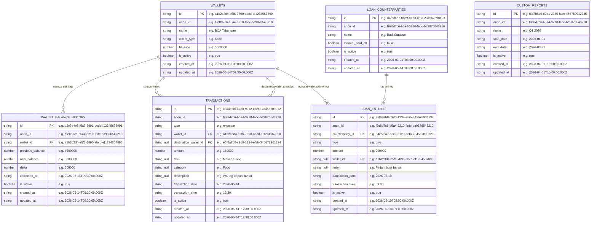

# ERD — IndexedDB Schema (pfintrack_db)

**Database:** `pfintrack_db` (IndexedDB)
**Object Stores:** 6 (`wallets`, `wallet_balance_history`, `transactions`, `loan_counterparties`, `loan_entries`, `custom_reports`)

---

---

## Catatan Relasi

| Relasi | Penjelasan |
|--------|-----------|
| `WALLETS` → `WALLET_BALANCE_HISTORY` | Hanya dicatat saat **manual edit balance** di `/wallet/[id]`. TIDAK pernah ditulis oleh operasi transaksi atau loan (§6.3). |
| `WALLETS` → `TRANSACTIONS` (source) | Setiap transaksi wajib punya sumber wallet. |
| `WALLETS` → `TRANSACTIONS` (destination) | Hanya ada untuk tipe `transfer`. Field `destination_wallet_id` nullable untuk income/expense. |
| `WALLETS` → `LOAN_ENTRIES` | Optional — loan entry boleh tidak terhubung ke wallet (`wallet_id` nullable). |
| `LOAN_COUNTERPARTIES` → `LOAN_ENTRIES` | Cascade soft-delete: jika counterparty dihapus, semua entry-nya ikut `is_active = false`. |
| `CUSTOM_REPORTS` | Berdiri sendiri, tidak ada FK ke object store lain — hanya menyimpan range tanggal untuk filter laporan. |

## Catatan Umum

- Semua record memiliki field universal: `id` (UUID v4), `anon_id`, `is_active`, `created_at`, `updated_at`.
- **Soft delete only** — record tidak pernah dihapus secara fisik. Saat dihapus: set `is_active = false`.
- `localStorage` hanya digunakan untuk flags: `pfintrack_anon_id`, `pfintrack_welcomed`, `tour_completed`, `pfintrack_color_theme`, `storage_version`.
- Semua angka disimpan sebagai JS `Number`, ditampilkan via `Intl.NumberFormat('id-ID')`.
- Semua tanggal disimpan sebagai ISO 8601 string.
